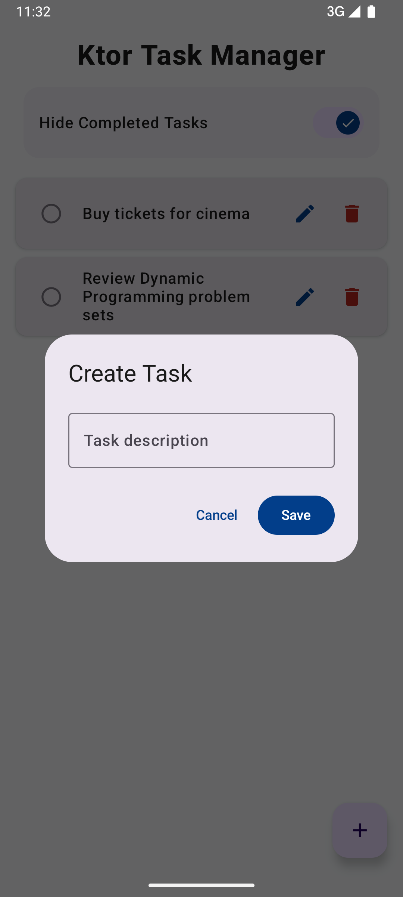
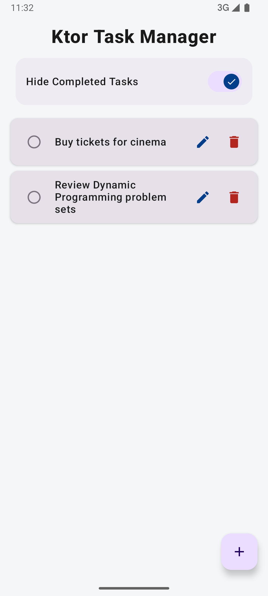
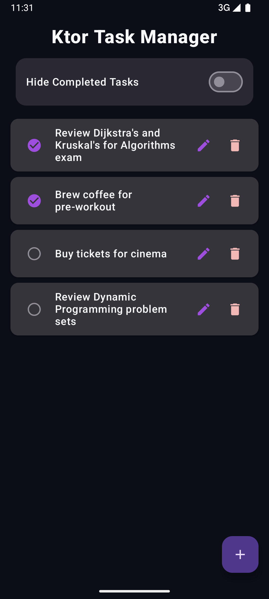
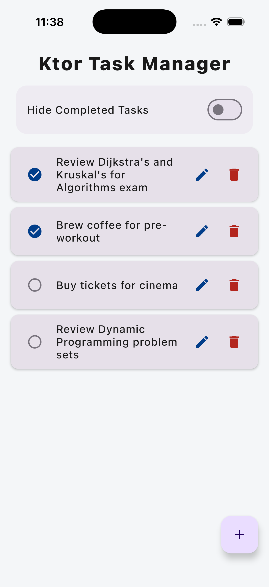
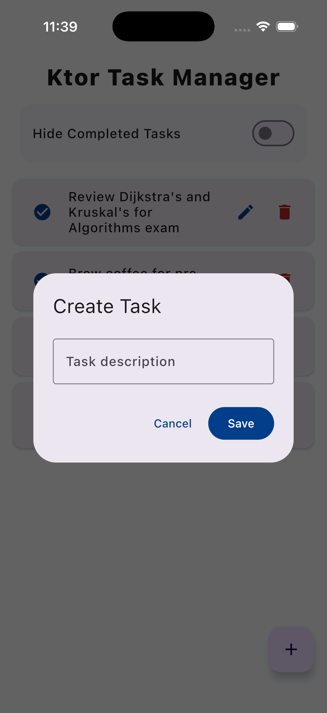
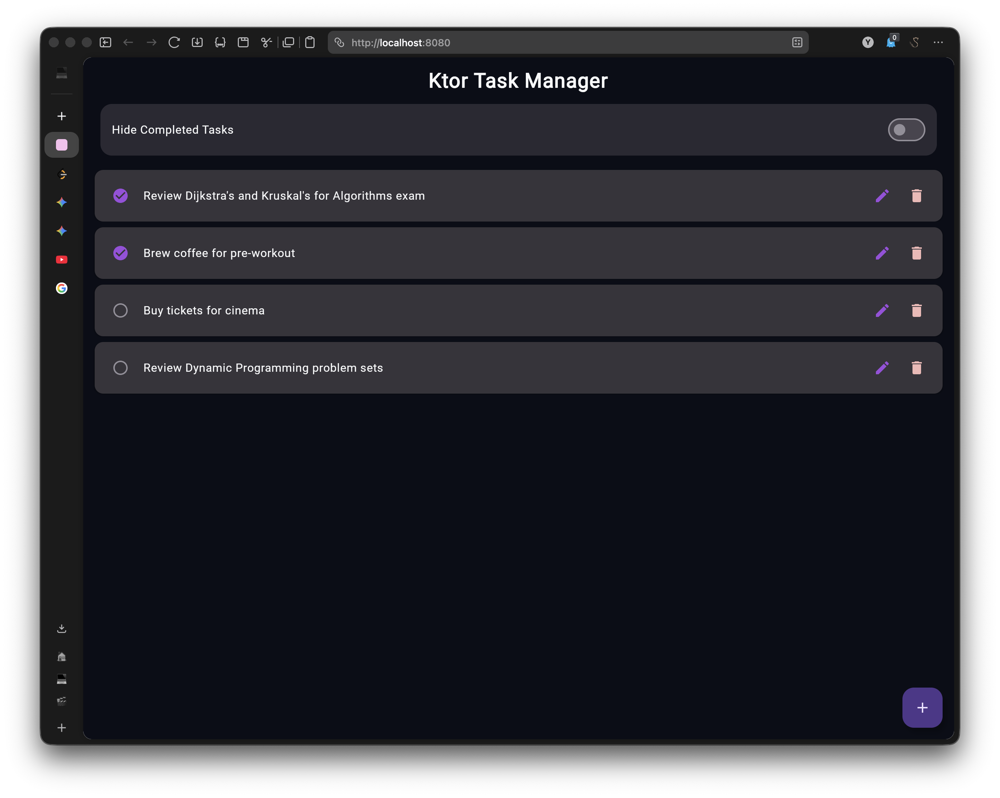
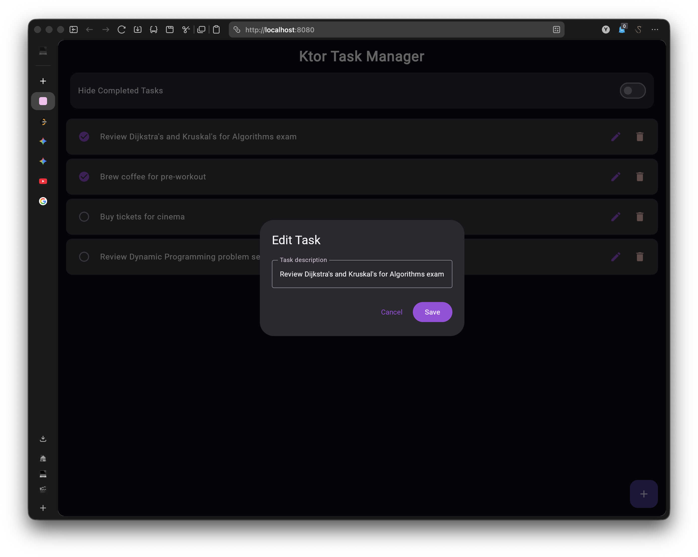
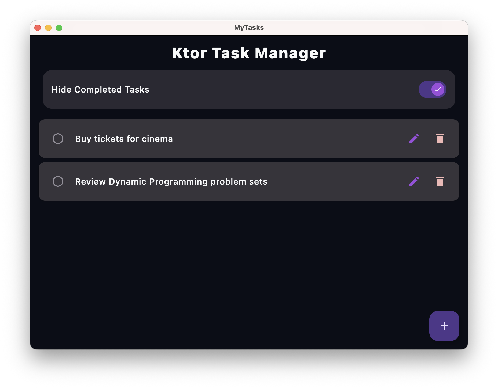
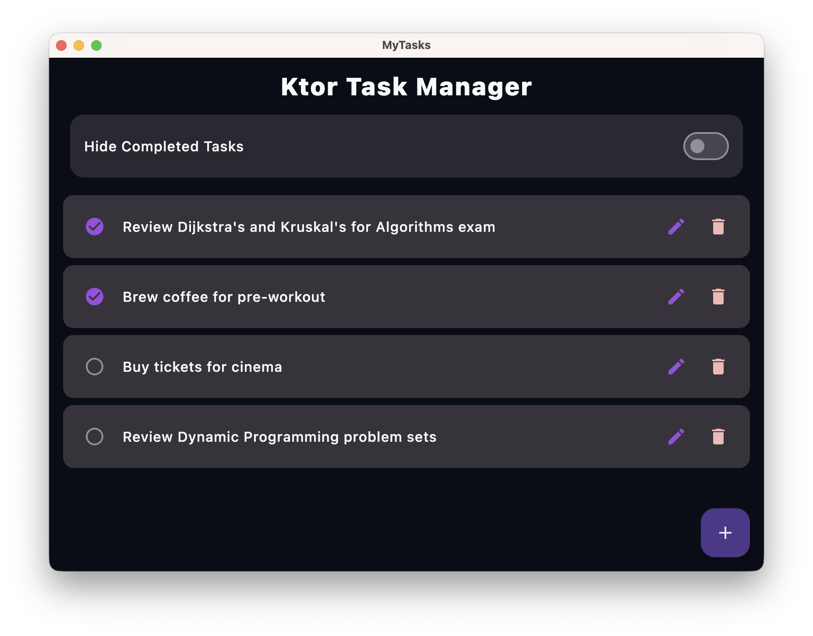

# 🚀 ToDoList - Full-Stack Kotlin Multiplatform

A professional-grade, full-stack task management application demonstrating 100% UI and business logic sharing across **Android, iOS, Web (WebAssembly), and Desktop (macOS/Windows)**.

This project goes beyond a simple frontend UI by integrating a completely custom backend, showcasing a complete end-to-end data pipeline driven entirely by Kotlin.

## 🛠️ Architecture & Tech Stack

### Frontend (Compose Multiplatform)
* **UI Framework:** Jetpack Compose / Compose Multiplatform (Skia graphics engine for Web/Desktop).
* **State Management:** Reactive Unidirectional Data Flow using Kotlin Coroutines and Flows.
* **Design System:** Custom "Deep Space" astronomy-inspired theming (Nebula Purple & Horizon Blue) with scalable Material Vector Icons.
* **Native Integration:** Platform-specific custom app icons (Adaptive XML for Android, `.xcassets` for iOS, direct OS injection for macOS taskbar, and Wasm Favicon).

### Backend (Ktor Server)
* **Server Framework:** Ktor (Netty engine).
* **API Design:** RESTful endpoints for full CRUD operations.
* **Cross-Origin Configuration:** Configured CORS policies to securely accept WebAssembly browser requests.

### Networking Bridge (Ktor Client)
* **Shared Client:** A single unified API client in the `shared` module.
* **Platform-Specific Engines:**
  * `Darwin` engine for native iOS performance.
  * `CIO` (Coroutine-based I/O) engine for JVM/Desktop.
  * `OkHttp` for Android.

## ✨ Key Features
* **Write Once, Run Everywhere:** The exact same UI code compiles natively to an iOS Simulator, an Android Emulator, a Mac Desktop Window, and a Google Chrome browser tab.
* **Real-Time API Communication:** Tasks added on the Web or Mobile app instantly sync with the local Ktor backend via asynchronous HTTP requests.
* **Polished UX:** Features buttery-smooth Compose animations, dynamic Material checkbox toggles, and seamless dark-mode-ready aesthetics.

  ## 📸 Cross-Platform Previews












## 🚀 How to Run Locally


### 1. Start the Backend Server
Navigate to the root directory and start the Ktor server on port `8081` (to avoid web port clashes):
```bash
./gradlew :server:run
```
### 2. Launch the Clients

*   **Android:** Select composeApp in Android Studio and hit Play for the Emulator.

*   **Web (Wasm):** Run ./gradlew :composeApp:wasmJsBrowserDevelopmentRun and open http://localhost:8080.

*   **Desktop (macOS/Windows):** Run ./gradlew :composeApp:run to launch the native JVM window.

*   **iOS:** Open iosApp/iosApp.xcodeproj in Xcode, select a Simulator or physical iPhone, and hit Play. (Note: Update BASE_URL in TaskApi.kt to your local network IP if testing on a physical device).

## 👨‍💻 Author
### Yunus Emre Computer Engineering
